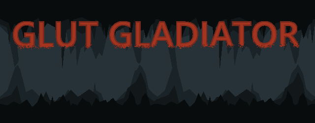

<p align="center">
  
</p> 


GLUT Gladiator is a procedurally generated top-down roguelike. 

# Game Info

The objective of the game is simple, follow the navigation arrow to the center of the cave, and destroy the boss!
Along the way, collect powerups, and fight ever increasing difficulty enemies. 
The game can be saved/loaded and is fully destructible.

# Build Information

GLUT Gladiator is built on Windows using **MSYS2**, **GNU**, and **MAKE**.

### Required Tools
- [MSYS64](https://www.msys2.org/) (ucrt64 for packages)
- [GCC](https://packages.msys2.org/base/mingw-w64-gcc) 
- [GDB](https://packages.msys2.org/base/mingw-w64-gdb) 
- [Make](https://packages.msys2.org/base/mingw-w64-make) 
- [OpenGL Glew](https://packages.msys2.org/packages/mingw-w64-ucrt-x86_64-glew) 
- [OpenGL Freeglut](https://packages.msys2.org/base/mingw-w64-freeglut) 
- [SDL3](https://github.com/libsdl-org/SDL/blob/main/docs/INTRO-mingw.md)

There are included (but required) header only libraries located inside of ``common/include``:
 - [stb_image](https://github.com/nothings/stb/blob/master/stb_image.h) (Image loader)
 - [toml](https://github.com/toml-lang/toml) (TOML Configuration Parser) 
 - [glm](https://github.com/g-truc/glm) (OpenGL Mathematics) 

### How To

To build, simply run:
 - ```make``` - Build application in debugging mode
 - ```make debug``` - Build application in debugging mode
 - ```make release``` - Build application in release mode
 - ```make clean``` - Clean application build files (recommended for odd build behaviors)
 - ```make publish PUB_DIR="publish"``` - Builds the application in release mode and packages the application into the provided **PUB_DIR** folder

# Download Information

Precompiled versions of the game are available via the **Releases** tab on the right hand side. 

To download, simply click on the version you wish to download, then download the top file (not the source code)

# Contributions

- **Frank Bernal**: (Audio and Characters, Windows features) 
  - Sourcing audio and enemy sprites. 
  - Character, Music, and menu sound effects. 
  - Traveling enemies. 
  - Seamless fullscreen/windowed mode transition. 
  - Active/Inactive state when window is minimized or not active.
  - Debugging
  
- **Joshua Bayt**: (Lead Software Engineer and Project Lead) 
  - World generation algorithm and world structure
  - Save/Load functionality
  - Artwork for tiles and turret sprites
  - Shader implemenation + lighting
  - Particle engine + Bullet system
  
- **Daniel Remington**: (Assistant Programmer and Menu Designer)
  - Helped to design menu system
  - Helped with the scene manager
  - Created the menu artwork and structure
  - Expanded on In-Game Level Editor
  - Made a HUD display for Editor
  - Assisted with image clarity for level editor

