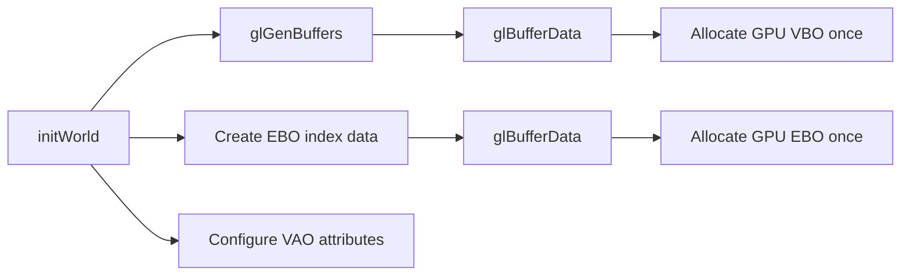

```mermaid
    flowchart LR
        A[initWorld] --> B[glGenBuffers]
        B --> C[glBufferData]
        C --> D[Allocate GPU VBO once]

        A --> E[Create EBO index data]
        E --> F[glBufferData]
        F --> G[Allocate GPU EBO once]

        A --> H[Configure VAO attributes]
```