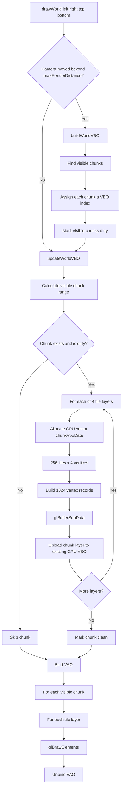

```mermaid
    flowchart TD
        A[drawWorld left right top bottom] --> B{Camera moved beyond maxRenderDistance?}

        B -->|Yes| C[buildWorldVBO]
        C --> C1[Find visible chunks]
        C1 --> C2[Assign each chunk a VBO index]
        C2 --> C3[Mark visible chunks dirty]

        B -->|No| D[updateWorldVBO]
        C3 --> D

        D --> D1[Calculate visible chunk range]
        D1 --> D2{Chunk exists and is dirty?}

        D2 -->|No| D3[Skip chunk]
        D2 -->|Yes| E[For each of 4 tile layers]

        E --> F[Allocate CPU vector chunkVboData]
        F --> G[256 tiles x 4 vertices]
        G --> H[Build 1024 vertex records]
        H --> I[glBufferSubData]
        I --> J[Upload chunk layer to existing GPU VBO]
        J --> K{More layers?}

        K -->|Yes| E
        K -->|No| L[Mark chunk clean]

        D3 --> M[Bind VAO]
        L --> M
        M --> N[For each visible chunk]
        N --> O[For each tile layer]
        O --> P[glDrawElements]
        P --> Q[Unbind VAO]
```